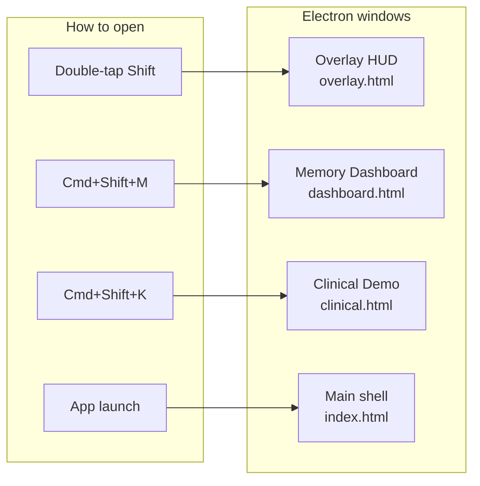
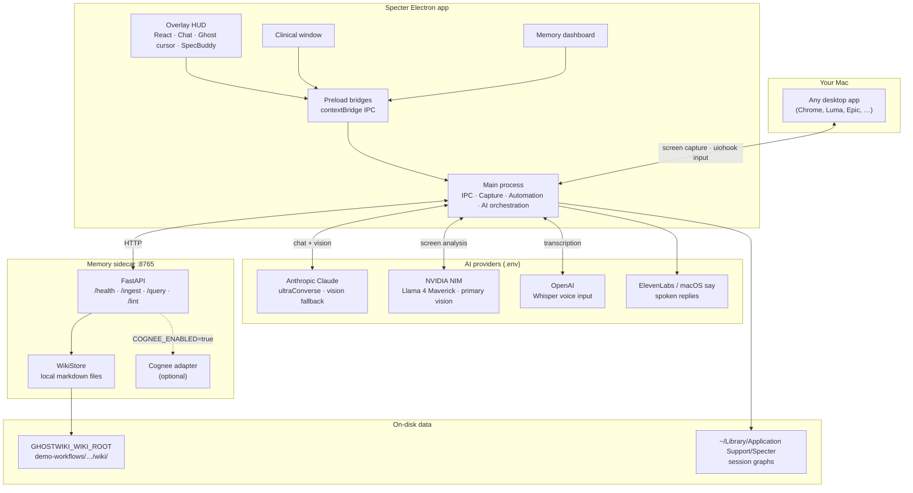
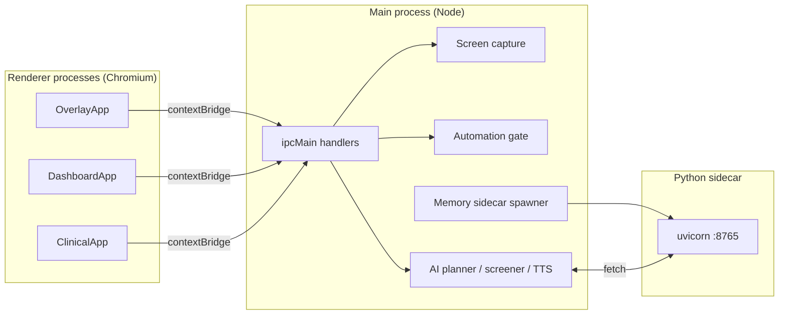
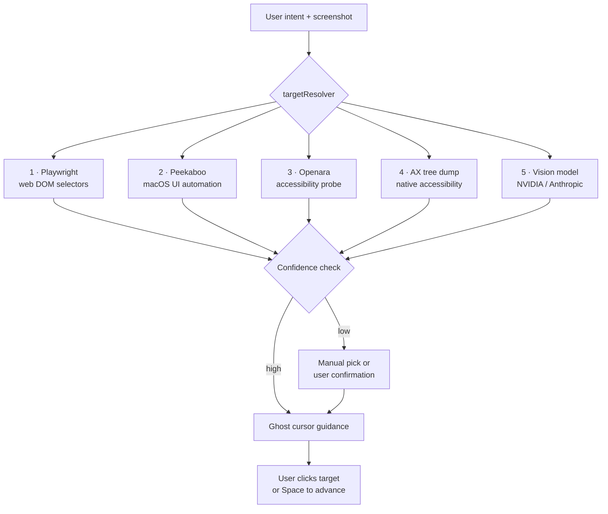
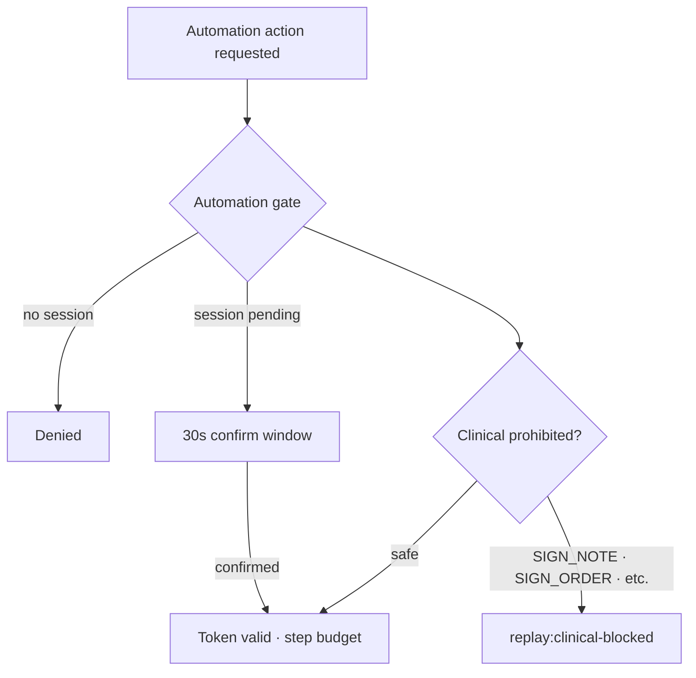
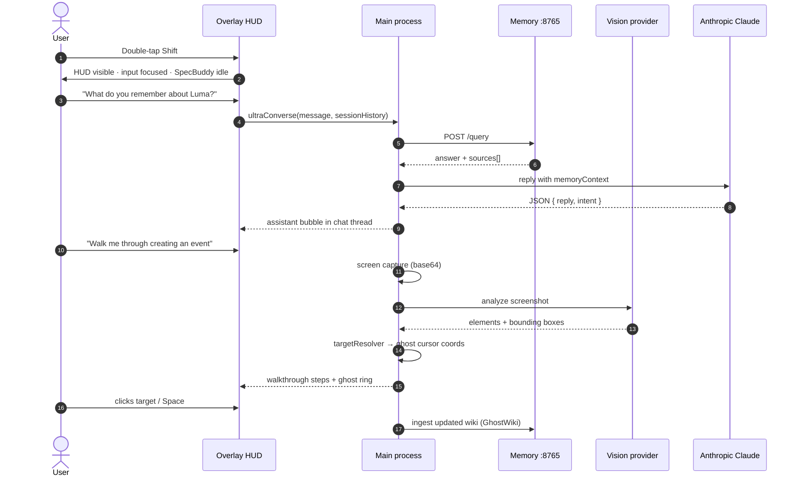
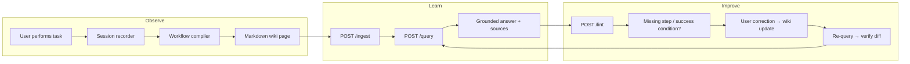
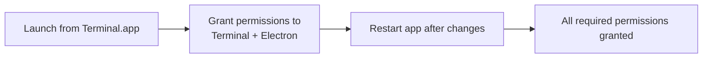

<div align="center">

# Specter

**A self-improving desktop ghost that remembers how you work — and teaches you back.**

Built for the **Cursor × A16Z** hackathon.

[](https://www.electronjs.org/)
[](https://react.dev/)
[](https://www.typescriptlang.org/)
[](https://www.python.org/)
[](https://www.apple.com/macos/)

[Quick Start](#quick-start) · [Architecture](#architecture) · [Demo Script](#demo-script) · [API Reference](#memory-service-api) · [Troubleshooting](#troubleshooting)

</div>

---

## Table of contents

- [Overview](#overview)
- [Why Specter](#why-specter)
- [Core concepts](#core-concepts)
- [What it does](#what-it-does)
- [UI surfaces](#ui-surfaces)
- [Architecture](#architecture)
  - [Process model](#process-model)
  - [Target resolution stack](#target-resolution-stack)
  - [Safety model](#safety-model)
- [How a session works](#how-a-session-works)
- [GhostWiki memory loop](#ghostwiki-memory-loop)
- [Memory service API](#memory-service-api)
- [Quick start](#quick-start)
- [Demo script](#demo-script)
- [Keyboard shortcuts](#keyboard-shortcuts)
- [Configuration](#configuration)
- [macOS permissions](#macos-permissions)
- [Building & packaging](#building--packaging)
- [Project structure](#project-structure)
- [Testing & verification](#testing--verification)
- [Troubleshooting](#troubleshooting)
- [Documentation index](#documentation-index)
- [Tech stack](#tech-stack)

---

## Overview

Specter is an **Electron desktop agent** that floats above any application on your Mac. It combines:

- **Conversational tutoring** — chat or voice with Claude, grounded in your session history
- **Screen understanding** — vision models identify UI elements on your real desktop
- **Ghost cursor guidance** — visual rings and a spectral cursor show where to click; you stay in control
- **Persistent workflow memory (GhostWiki)** — observed tasks compile into markdown wiki pages you can query, lint, and correct
- **Self-improvement loop** — ingest → query → lint → correct → re-query, all against a local memory service

Unlike a browser chatbot, Specter runs **on your machine**, captures **your actual screen**, and remembers **how you personally use software**.

---

## Why Specter

| Problem | Specter's approach |
| --- | --- |
| "How do I do this again?" | Recalls past workflows from a local wiki and walks you through them step by step |
| Generic AI answers | Grounds replies in **your** session history, corrections, and saved memories |
| Brittle screen bots | Multi-tier target resolution (Playwright → Peekaboo → Openara → AX → Vision) with confidence gates |
| One-shot demos | Living memory that ingests, lints gaps, accepts corrections, and improves on re-query |
| Unsafe automation | Token-gated automation sessions, prohibited clinical actions, walkthrough-first design |

---

## Core concepts

| Term | Meaning |
| --- | --- |
| **Overlay** | Always-on-top transparent HUD summoned with double-tap Shift |
| **SpecBuddy** | Animated ghost companion that reacts to session mood and state |
| **Ghost cursor** | Visual guide ring showing where to click on your real desktop |
| **GhostWiki** | Workflow memory system — markdown wiki + Python sidecar API |
| **Memory sidecar** | Local FastAPI service on port `8765` (auto-started in `ghostwiki` mode) |
| **Walkthrough** | Guided mode: Specter shows targets; **you** click to advance |
| **Ultra mode** | Voice-forward tutoring — replies may be read aloud via TTS |
| **Silent / Chat mode** | Text-first conversation with full chat thread UI |
| **Lint** | Memory service checks wiki pages for missing steps or success conditions |
| **Correction** | User feedback written back to wiki; subsequent queries reflect the fix |

---

## What it does

### 1. Overlay ghost tutor

Summon Specter anywhere with **double-tap Shift**. A spectral HUD appears over your desktop with:

- Chat thread (user + ghost bubbles)
- Chat / Voice mode toggle
- Memory panel (GhostWiki ingest, query, lint, demo loop)
- SpecBuddy — reacts to idle, thinking, success, and error states

On summon, the input bar is **auto-focused** so you can type immediately.

### 2. Guided walkthroughs

Ask Specter to teach you something:

> *"Walk me through creating an event"*
> *"Teach me how to click the address bar in Chrome"*

Specter captures your screen, resolves UI targets through the resolution stack, and guides you with a ghost cursor. Low-confidence vision hits pause for manual target picking or confirmation.

### 3. GhostWiki — workflow memory

Specter compiles observed workflows into **markdown wiki pages** with YAML frontmatter. The memory sidecar indexes these pages and answers natural-language queries:

> *"What do you remember about the Luma event workflow?"*

Answers cite real sources — event title, date, hosts, location — from the bundled demo wiki at `demo-workflows/event-recap/wiki/`.

### 4. Memory dashboard

Press **Cmd+Shift+M** to open a dedicated window showing:

- Saved memory entries parsed from wiki markdown
- Correction history
- Per-app skill progress from session graphs

### 5. Clinical workflow mode *(demo)*

Press **Cmd+Shift+K** for a UCSF APeX / Epic-style clinical documentation demo:

- Multi-note context capture into a `ClinicalContextBundle`
- 26-step semantic workflow across 6 phases
- Source-grounded draft notes (verbatim quotes or `[Not found in provided notes]`)
- Hard safety gates blocking autonomous `SIGN_NOTE`, `SIGN_ORDER`, and medication submission

See [`docs/CLINICAL_WORKFLOW.md`](docs/CLINICAL_WORKFLOW.md) for the full safety model.

---

## UI surfaces

Specter ships four renderer surfaces, each with its own preload bridge:



| Surface | Hotkey | Purpose |
| --- | --- | --- |
| Overlay HUD | Double-tap **Shift** | Primary tutor — chat, voice, ghost cursor, memory panel |
| Memory Dashboard | **Cmd+Shift+M** | Browse memories, corrections, skill progress |
| Clinical window | **Cmd+Shift+K** | EHR documentation demo with safety gates |
| Main shell | App launch | Dev shell and background orchestration |

---

## Architecture

Specter is a **multi-process desktop system**: an Electron shell (main + renderers), a Python memory sidecar, and pluggable cloud AI providers.



### Process model



- **Main process** owns all privileged operations: screen capture, mouse movement, API keys, sidecar lifecycle.
- **Renderer processes** are sandboxed React apps that communicate only through typed preload APIs.
- **Memory sidecar** starts automatically when `SPECTER_MODE=ghostwiki` (default).

### Target resolution stack

When Specter needs to highlight or guide a click, targets resolve through a **priority pipeline** — deterministic signals first, vision last.



| Priority | Provider | Best for |
| --- | --- | --- |
| 1 | Playwright | Web apps with known selectors |
| 2 | Peekaboo | macOS native UI automation (optional binary) |
| 3 | Openara | Accessibility tree probing |
| 4 | AX dump | Pixel-precise macOS accessibility targets |
| 5 | Vision | Screenshot analysis when structural signals fail |

Run `npm run test:targetResolver` to verify the priority chain offline.

### Safety model

Specter defaults to **walkthrough-first** design — the user clicks; Specter guides.



| Layer | What it protects |
| --- | --- |
| **Automation gate** | Token + confirm + expiry + per-session step budget |
| **Replay safety** | AST guard prevents walkthrough code from calling real-mouse automation |
| **Clinical gate** | Runtime block on signing, order submission, advisory bypass |
| **IPC guards** | Typed handlers; security-check script validates surface area |
| **Vision confirmation** | Low-confidence targets require explicit user approval |

---

## How a session works



### Overlay interaction modes

| Mode | Input | Output | Best for |
| --- | --- | --- | --- |
| **Chat (silent)** | Typed text | Chat bubbles | Demos, quiet environments |
| **Voice (ultra)** | Typed text (+ mic if Whisper configured) | Bubbles + spoken TTS | Hands-free tutoring |
| **Memory panel** | Button toggle | GhostWiki ingest/query/lint UI | Self-improvement demo |

---

## GhostWiki memory loop

GhostWiki turns observed workflows into a **living operating manual** for how you use software.



### Bundled demo data

The repo ships a synthetic **Luma event-recap** workflow at `demo-workflows/event-recap/`:

| Asset | Purpose |
| --- | --- |
| `wiki/luma-event-profile.md` | Event metadata (title, date, hosts, location) |
| `wiki/target-create-event.md` | Create-event workflow steps |
| `wiki/target-add-to-calendar.md` | Add-to-calendar workflow |
| `graph.json` | Compiled session graph |
| `recording.synthetic.jsonl` | Synthetic behavioral recording |

The demo wiki is **intentionally missing a success condition** so the lint engine can catch it during the self-improvement loop.

---

## Memory service API

The Python sidecar runs at `http://127.0.0.1:8765` (configurable via `MEMORY_SERVICE_PORT`).

### Endpoints

#### `GET /health`

```bash
curl -s http://127.0.0.1:8765/health
```

```json
{
  "status": "ok",
  "cognee_enabled": false,
  "wiki_root": "./demo-workflows/event-recap/wiki"
}
```

#### `POST /ingest`

Index wiki markdown files into memory (Cognee or fallback mode).

```bash
curl -s -X POST http://127.0.0.1:8765/ingest \
  -H "Content-Type: application/json" \
  -d '{"files": []}'
```

Empty `files` array ingests all `.md` files under `GHOSTWIKI_WIKI_ROOT`.

**Response shape:**

```json
{
  "ok": true,
  "mode": "fallback",
  "warnings": [],
  "sources_ingested": 4
}
```

#### `POST /query`

Natural-language query against ingested memory.

```bash
curl -s -X POST http://127.0.0.1:8765/query \
  -H "Content-Type: application/json" \
  -d '{"query": "What is the Luma event date and location?"}'
```

**Response shape:**

```json
{
  "ok": true,
  "mode": "fallback",
  "answer": "...",
  "sources": [
    { "id": "luma-event-profile", "title": "...", "content": "...", "score": 1.0 }
  ],
  "warnings": []
}
```

#### `POST /lint`

Check wiki pages for structural gaps (missing success conditions, incomplete steps).

```bash
curl -s -X POST http://127.0.0.1:8765/lint \
  -H "Content-Type: application/json" \
  -d '{}'
```

**Response shape:**

```json
{
  "ok": true,
  "mode": "fallback",
  "issues": [
    {
      "rule": "missing_success_condition",
      "message": "...",
      "severity": "error",
      "file": "target-create-event.md"
    }
  ],
  "warnings": []
}
```

### Cognee vs fallback mode

| Mode | Env | Behavior |
| --- | --- | --- |
| **Fallback** (default) | `COGNEE_ENABLED=false` | Local markdown search + procedural answer synthesis |
| **Cognee** | `COGNEE_ENABLED=true` | Cognee graph backend for ingest/query |

The hackathon demo uses **fallback mode** for deterministic, offline-friendly behavior.

---

## Quick start

### Prerequisites

| Requirement | Version | Notes |
| --- | --- | --- |
| macOS | 13+ | Primary platform; permissions are macOS-first |
| Node.js | 20+ | Electron 30 runtime |
| npm | 9+ | Package management |
| Python | 3.10+ | Memory sidecar (auto-spawned on launch) |
| API keys | — | `.env` for live AI (see [Configuration](#configuration)) |

### Install

```bash
git clone https://github.com/aritroBh/cursor-x-a16z.git
cd cursor-x-a16z
npm install
cp .env.example .env
```

Edit `.env` and set at minimum:

```bash
ANTHROPIC_API_KEY=your_key_here
```

### Run

```bash
npm run dev
```

> **Important:** Launch from **Terminal.app**, not an IDE terminal. macOS privacy permissions attach to the **launching process**. Terminal typically already has Screen Recording and Input Monitoring grants.

Wait for these log lines:

```
[STARTUP] Active Mode: ghostwiki
All required permissions granted
```

The memory sidecar starts automatically on port **8765**.

### Verify

```bash
# In a second terminal
curl -s http://127.0.0.1:8765/health
npm run test:specter
```

### First interaction

1. **Double-tap Shift** — overlay appears, caret in input bar
2. Type: *"What do you remember about the Luma event workflow?"*
3. Toggle **Chat / Voice** modes
4. Click **Memory** → explore GhostWiki panel
5. **Cmd+Shift+M** → open memory dashboard

---

## Demo script

A verified **3-minute demo** flow (see [`DEMO_RUNBOOK.md`](DEMO_RUNBOOK.md) for troubleshooting):

| Step | Action | What the audience sees |
| --- | --- | --- |
| 1 | Double-tap Shift | Ghost appears, input focused |
| 2 | *"What do you remember about the Luma event workflow?"* | Grounded reply from real wiki memory |
| 3 | *"Who are you?"* | Chat thread with user/ghost bubbles |
| 4 | Toggle Chat / Voice | Mode switch + optional TTS |
| 5 | *"Walk me through creating an event"* | Target detection + ghost cursor |
| 6 | Cmd+Shift+M | Memory dashboard — saved memories, skill progress |
| 7 | Memory panel → **Run Winning Demo** | Ingest → query → lint → correction → re-query live |

**Closing line:** *"This isn't RAG over static docs. It's a living operating manual for how you use software."*

---

## Keyboard shortcuts

| Shortcut | Action |
| --- | --- |
| **Double-tap Shift** | Summon / dismiss overlay (input auto-focused) |
| **Cmd+Shift+M** | Open memory dashboard |
| **Cmd+Shift+K** | Open clinical workflow window |
| **Cmd+Shift+D** | Toggle DevTools *(dev builds only)* |
| **Space** | Advance walkthrough step (during guided mode) |

---

## Configuration

Copy `.env.example` → `.env`. **Never commit `.env`.**

### Environment reference

| Variable | Required | Default | Purpose |
| --- | --- | --- | --- |
| `ANTHROPIC_API_KEY` | For live chat | — | Claude conversation + vision fallback |
| `VISION_PROVIDER` | No | `nvidia` | `nvidia` · `anthropic` · `mock` |
| `NVIDIA_API_KEY` | For NVIDIA vision | — | Llama 4 Maverick screen analysis |
| `NVIDIA_VISION_MODEL` | No | `meta/llama-4-maverick-17b-128e-instruct` | Vision model ID |
| `OPENAI_API_KEY` | No | — | Whisper voice input |
| `ELEVENLABS_API_KEY` | No | — | Natural TTS (falls back to macOS `say`) |
| `SPECTER_MODE` | No | `ghostwiki` | Startup mode: `ghostwiki` · `ultra` |
| `MEMORY_SERVICE_PORT` | No | `8765` | Memory sidecar port |
| `GHOSTWIKI_WIKI_ROOT` | No | `./demo-workflows/event-recap/wiki` | Wiki markdown root |
| `COGNEE_ENABLED` | No | `false` | Enable Cognee graph backend |
| `SPECTER_ENABLE_DEV_FALLBACK` | No | — | Synthetic demo data in production builds |
| `DEBUG_VERBOSE` | No | — | Verbose main-process logging |

### Minimal `.env` for demo

```bash
ANTHROPIC_API_KEY=sk-ant-...
SPECTER_MODE=ghostwiki
MEMORY_SERVICE_PORT=8765
GHOSTWIKI_WIKI_ROOT=./demo-workflows/event-recap/wiki
COGNEE_ENABLED=false
VISION_PROVIDER=nvidia
NVIDIA_API_KEY=nvapi-...
```

Full vision provider docs: [`docs/VISION_PROVIDERS.md`](docs/VISION_PROVIDERS.md)

---

## macOS permissions

Grant these in **System Settings → Privacy & Security**:

| Permission | Why Specter needs it |
| --- | --- |
| **Screen Recording** | Screenshot capture for vision analysis and target detection |
| **Accessibility** | Cursor position tracking and UI element resolution |
| **Input Monitoring** | Keyboard/mouse event capture for behavioral session recording |



**Tips:**

- Permissions follow the **parent process** that launched Electron. Use Terminal.app.
- Toggle both **Terminal** and **Electron** in Screen Recording if overlay won't summon.
- Red permission banner usually clears within ~15s once input frames flow.

---

## Building & packaging

```bash
# Development
npm run dev

# Production build
npm run build

# Platform packages
npm run build:mac      # macOS .dmg
npm run build:win      # Windows
npm run build:linux    # Linux
npm run build:unpack   # Unpacked dir (no installer)
```

Build output lands in `out/` (electron-vite) and `dist/` (electron-builder).

---

## Project structure

```
cursor-x-a16z/
├── src/
│   ├── main/                    # Electron main process
│   │   ├── ai/                  # planner, screener, TTS, whisper, config
│   │   ├── automation/          # peekabooAdapter, targetResolver
│   │   ├── clinical/            # EHR demo workflow engine
│   │   ├── session/             # recorder, replay, graph, storage
│   │   ├── vision/              # NVIDIA, Anthropic, mock providers
│   │   ├── wiki/                # workflowCompiler, wikiWriter
│   │   ├── security/            # automationGate, ipcGuards
│   │   ├── dashboard.ts         # Memory dashboard IPC
│   │   ├── memorySidecar.ts     # Python sidecar spawner
│   │   └── index.ts             # App entry, shortcuts, IPC registration
│   ├── preload/                 # contextBridge APIs (overlay, dashboard, clinical)
│   └── renderer/                # React UI surfaces
│       ├── overlay/             # InputBar, ChatThread, SpecBuddy, GhostWikiPanel
│       ├── dashboard/           # DashboardApp
│       └── clinical/            # ClinicalApp
├── memory_service/              # Python FastAPI sidecar
│   ├── app.py                   # /health, /ingest, /query, /lint
│   ├── wiki_store.py            # Local markdown indexer
│   ├── lint_engine.py           # Wiki gap detection
│   └── tests/                   # 21 pytest cases
├── demo-workflows/
│   └── event-recap/             # Bundled Luma hackathon demo
├── docs/                        # Deep-dive guides
├── scripts/                     # Test runners, demo scripts, security-check
└── test/fixtures/               # Offline test assets (screenshots, clinical notes)
```

---

## Testing & verification

### Full pre-demo suite

```bash
npm run security-check       # IPC surface + automation safety guards
npm run test:specter         # 350+ integration checks
npm run test:targetResolver  # Target priority chain (8 tests)
npm run test:peekabooAdapter # Peekaboo adapter gating
npm run test:vision          # Offline vision provider tests
npm run lint
npm run build
```

### Memory service

```bash
pip install -r memory_service/requirements.txt
python -m pytest memory_service/tests -q    # 21 tests
```

### Live vision smoke test

Requires `NVIDIA_API_KEY` in `.env`:

```bash
npm run test:vision:live
```

Uses `test/fixtures/screenshot.png` — prints provider, model, latency, and element count without logging keys or base64.

### Clinical demo (offline)

```bash
npm run test:clinical
npm run clinical:demo
```

---

## Troubleshooting

| Symptom | Fix |
| --- | --- |
| Overlay won't summon | Relaunch from **Terminal.app** (permissions follow launcher) |
| Red "Missing permissions" banner | Wait ~15s; or grant Screen Recording + Input Monitoring to Terminal **and** Electron, then relaunch |
| Memory panel shows "Offline" | `kill $(lsof -ti :8765)` then relaunch app (sidecar auto-restarts) |
| Chat says "API key not configured" | Add `ANTHROPIC_API_KEY` to `.env` |
| Port 8765 in use | Kill orphan process: `kill $(lsof -ti :8765)`, relaunch |
| Clicks pass through HUD | Hover over HUD first (arms interactivity), or re-summon with double-shift |
| Voice input doesn't work | Needs `OPENAI_API_KEY` for Whisper; typed input still works |
| Full auto mouse control unavailable | Needs Peekaboo binary; use guided walkthrough mode instead |
| Dashboard clicks blocked | Dismiss overlay first (double-shift) — overlay sits on top |

Pre-demo cleanup:

```bash
pkill -f "electron-vite dev"
pkill -f "MacOS/Electron ."
kill $(lsof -ti :8765) 2>/dev/null
npm run dev
```

---

## Documentation index

| Document | Contents |
| --- | --- |
| [`DEMO_RUNBOOK.md`](DEMO_RUNBOOK.md) | Verified demo script, hotkeys, troubleshooting |
| [`DEMO_SCRIPT.md`](DEMO_SCRIPT.md) | Narrative talking points for presentations |
| [`GHOSTWIKI_ACCEPTANCE.md`](GHOSTWIKI_ACCEPTANCE.md) | Hackathon acceptance criteria + test outputs |
| [`memory_service/README.md`](memory_service/README.md) | Sidecar setup, endpoints, Cognee mode |
| [`docs/VISION_PROVIDERS.md`](docs/VISION_PROVIDERS.md) | NVIDIA, Anthropic, mock vision config |
| [`docs/CLINICAL_WORKFLOW.md`](docs/CLINICAL_WORKFLOW.md) | Clinical mode architecture + safety gates |
| [`docs/UCSF_APEX_COMPLIANCE.md`](docs/UCSF_APEX_COMPLIANCE.md) | APeX compliance notes |
| [`docs/real-product-smoke-test.md`](docs/real-product-smoke-test.md) | Real-app ghost tutor smoke tests |
| [`docs/manual-stress-test-checklist.md`](docs/manual-stress-test-checklist.md) | Manual QA checklist |
| [`docs/reality-lock.md`](docs/reality-lock.md) | Reality-lock design notes |

---

## Tech stack

| Layer | Technologies |
| --- | --- |
| Desktop shell | Electron 30, electron-vite 2, TypeScript 5.3 |
| UI | React 18, Tailwind CSS 4, custom spectral overlay CSS |
| AI — conversation | Anthropic Claude (`@anthropic-ai/sdk`) |
| AI — vision | NVIDIA NIM (Llama 4 Maverick), Anthropic Claude Vision |
| AI — voice | OpenAI Whisper (input), ElevenLabs / macOS `say` (output) |
| Automation | `@nut-tree-fork/nut-js`, `uiohook-napi`, Peekaboo adapter, macOS AX dump |
| Memory | Python FastAPI, local markdown wiki, optional Cognee |
| Testing | ts-node scripts, pytest, eslint, prettier |
| Packaging | electron-builder |

---

<div align="center">

**Cursor × A16Z** — Specter shows what happens when a coding agent remembers how *you* use software.

[Report an issue](https://github.com/aritroBh/cursor-x-a16z/issues) · [View demo runbook](DEMO_RUNBOOK.md)

</div>
